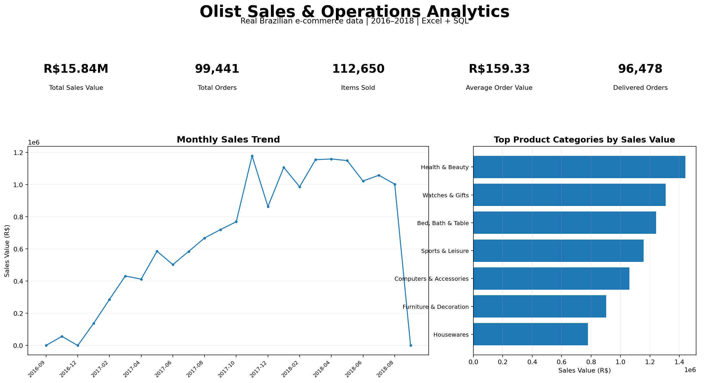

# Olist Sales & Operations Analytics

## Key Insights
- **R$15.84M** total sales value across **99,441 orders** and **112,650 order items**.
- **November 2017** was the peak sales month at approximately **R$1.18M**.
- **Health & Beauty** was the leading product category at approximately **R$1.44M**.
- **São Paulo (SP)** was the dominant customer market, while **credit card** was the leading payment method.

## Project Overview
Sales and operations analytics project using the **Brazilian E-Commerce Public Dataset by Olist**, a real commercial dataset anonymized for privacy. The data covers Brazilian marketplace orders from 2016–2018 across relational tables for orders, customers, order items, products, sellers and payments.

## Tools
- **Excel** — KPI dashboard, monthly sales trend and product-category analysis
- **SQL** — joins, aggregations, monthly analysis, customer/state/category/payment/seller analysis

## KPI Definition
**Sales Value = item price + freight value**

## Verified Snapshot
- Total Sales Value: **R$15.84M**
- Orders: **99,441**
- Order Items: **112,650**
- Average Order Value: **R$159.33**
- Delivered Orders: **96,478**

## Dashboard
The Excel workbook contains the KPI summary, monthly sales trend, top product categories and source/method documentation.

## Data Modeling Note
Use `customer_unique_id` for repeat-customer analysis. `customer_id` is order-specific and should not be treated as a persistent customer identity.

## Repository Files
- `Olist_Real_Sales_Operations_Analytics.xlsx` — Excel dashboard and analysis
- `sql/olist_sales_operations_analysis.sql` — SQL analysis queries

## How to Run the SQL Analysis
1. Download the Olist dataset from the source below and load the CSV files into a SQL database.
2. Use table names matching the SQL script:
   - `olist_orders`
   - `olist_order_items`
   - `olist_customers`
   - `olist_products`
   - `product_category_name_translation`
   - `olist_order_payments`
3. Run `sql/olist_sales_operations_analysis.sql` in a PostgreSQL-compatible environment. The script uses `DATE_TRUNC`, `FILTER` and `EXTRACT(EPOCH ...)` syntax.
4. The project defines **Sales Value = item price + freight value**.

## Dataset Source
[Olist Brazilian E-Commerce Public Dataset on Kaggle](https://www.kaggle.com/olistbr/brazilian-ecommerce)

Raw dataset files are not stored in this repository; download them from the source above.

## Portfolio Integrity
This project uses real anonymized commercial data and is **not synthetic**. Very small edge-period volumes should be interpreted cautiously.
